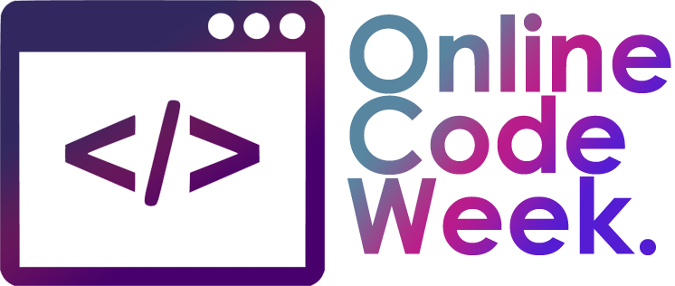
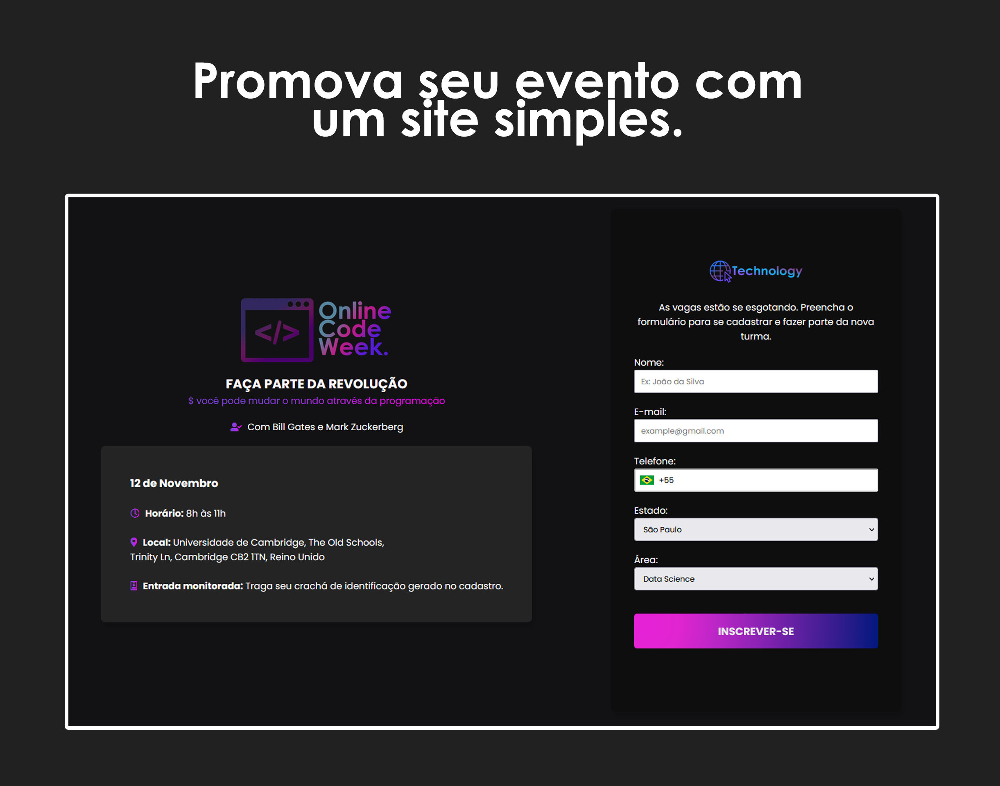
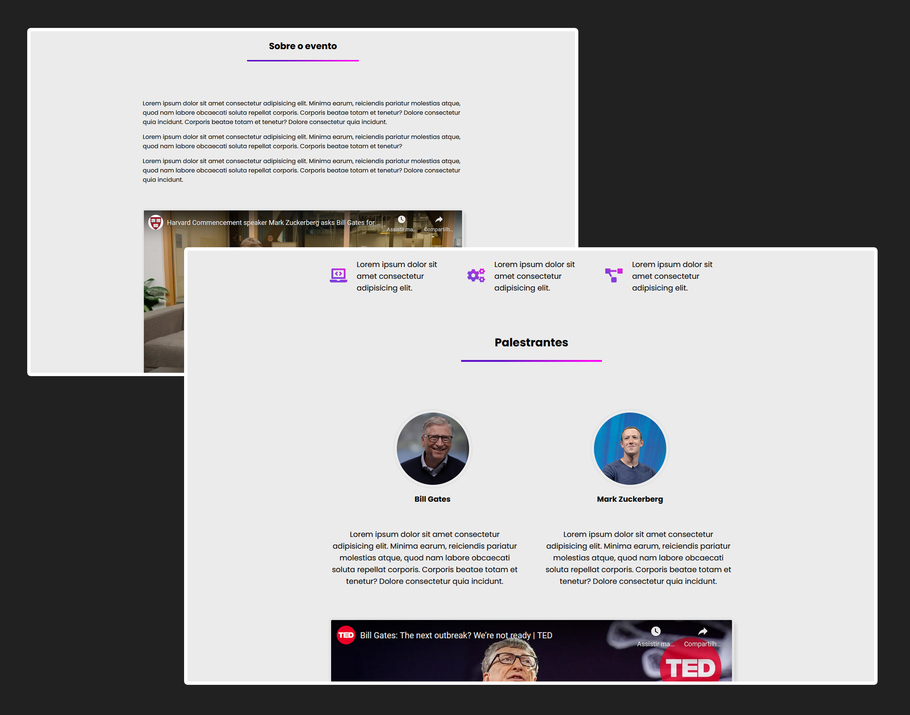
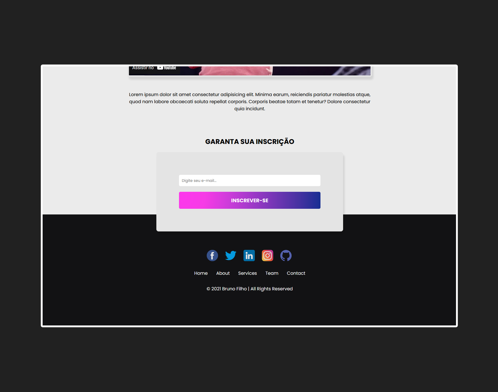

<div align="center">
  
</div>

<h1 align="center">
    
</h1>


## 💻 Sobre o projeto

Esse é o front de uma landing page simples, para promoção de algum evento, curso ou qualquer outro produto digital.

Por enquanto só está disponível a versão desktop sem responsividade pra mobile.

<br>

<h1 align="center">
    
</h1>

<h1 align="center">
    
</h1>

<br>

## 🧪 Tecnologias usadas

Esse projeto foi desenvolvido com as seguintes tecnologias:

- [React](https://reactjs.org)
- [SCSS](https://sass-lang.com/)

## 🔗  Clone a aplicação

Clone o projeto e acesse a pasta do mesmo.

```bash
$ git clone https://github.com/brunofilho1/react-landing-page/
$ cd react-landing-page
```
## 🚀 Como iniciar a aplicação

Para iniciá-lo, siga os passos abaixo:
```bash
# Instalar as dependências
$ yarn
# Iniciar o projeto
$ yarn start
```
O app estará disponível no seu browser pelo http://localhost:3000 assim que iniciado.

## 🌐 Live preview
Por enquanto sem Live Preview

## 📝 Licença MIT

Esse projeto está sob a licença MIT. Veja o arquivo [LICENSE](LICENSE) para mais detalhes.

---
